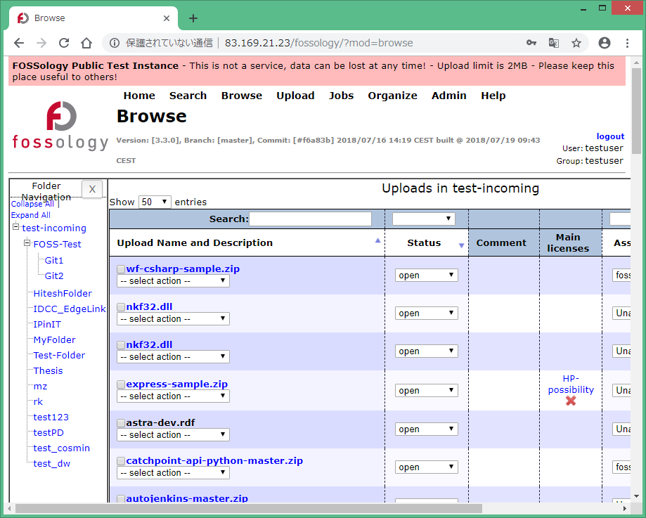
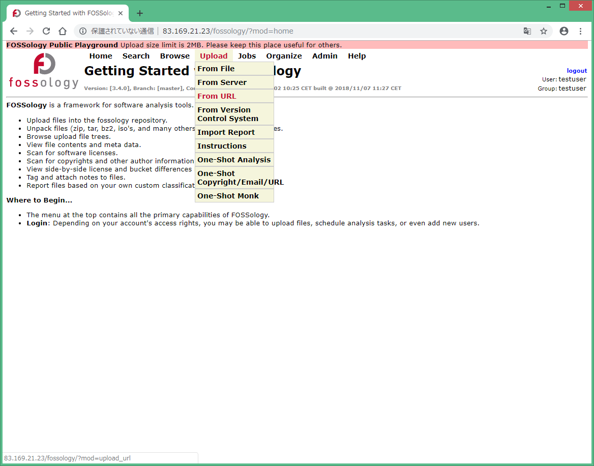
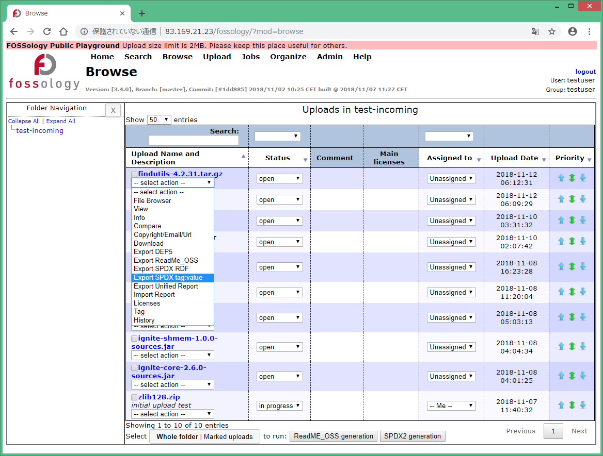
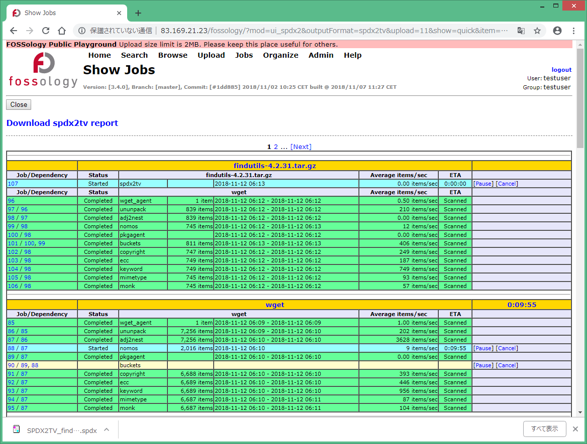
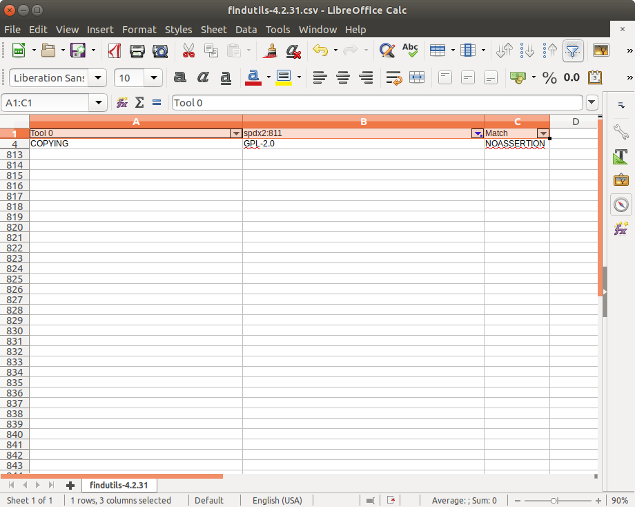

# OSS license analysis using FOSSology to verify license in each file

## reported by Yuki Machida (translated by Hiro Fukuchi)

original (Japanese): 
https://qiita.com/machida-yuki/items/8738961fa3133296d4c7

---

## Operating environment

Note: Only the following environment has been verified.

| Component        | Version  |
|:------------|:-------------|
| license-coverage-grader | 41baaa4 |
| Python | 2.7.12 |
| FOSSology | 3.4.0  |
| SPDX | 2.1 |
| SPDX License List | 2.6 |
| Git | 2.17.1 |
| Google Chrome | 70.0.3538.77  |
| LibreOffice | 6.0.3.2 |
| Ubuntu Desktop Japanese Remix	 |  18.04 |

---

## Procedure

Prerequisite: 
Ubuntu Desktop Japanese Remix is installed.
Basic setting of enviroment is completed.


### Installing license-converage-grader

license-converage-grader is a tool to generate the "grade score" how accurate the SPDX file gives license information for included files. 

If you need more information, please refer to the folloeing URL.

* GitHub - license-coverage-grader
  * https://github.com/spdx/license-coverage-grader


Installing git and pip, using apt command.

```
$ sudo apt update
$ sudo apt install git python-pip
$ sudo -EH pip install --upgrade pip
```


Cloning license-coverage-grader.git from GitHub repository, installing python module.

```
$ git clone https://github.com/spdx/license-coverage-grader.git
$ cd license-coverage-grader/
$ sudo -EH pip install --editable .
```

### Analyzing source code, generating SDPX file

In this report, FOSSology demo server is used.

* FOSSology demo server
  * http://83.169.21.23/fossology

This report chooses "findutils" as input source code. 

* findutils
  * https://ftp.gnu.org/pub/gnu/findutils/findutils-4.2.31.tar.gz


Accessing the FOSSology demo server via web browser.

Username: testuser , Password: test


After successful login, the following screen image will appear.

Note: File names in uploads in test-incoming may differ fro this image.













### Generating license list for each file


```
$ python -s <path to the directory of license-coverage-grader>/license-coverage-grader/spdx_scanner.py findutils-4.2.31.spdx > findutils-4.2.31.csv
```


### Verifying licenses





---

## Note

The author provides "ASIS" information and no warranty for trying the content of this report. 

This report uses FOSSology demo server, for beginners can try easily. 
Input files are transfered outside organization, so that files contain internal informaion or have large file size are not adequate for this test. In such cases, it is better to build an internal environment.

If you need more detail information about FOSSology environment, please visit FOSSology site.

* FOSSology environment
  * https://github.com/fossology/fossology/blob/master/README.md


---

## Resources

* OpenChain Project
  * https://www.openchainproject.org/
  
* SPDX
  * https://spdx.org/
  
* FOSSology
  * https://www.fossology.org/
  
* GitHub - license-coverage-grader
  * https://github.com/spdx/license-coverage-grader
  
* SPDX 2.1 Specification
  * https://spdx.org/sites/cpstandard/files/pages/files/spdxversion2.1.pdf
  
* SPDX License List
  * https://spdx.org/licenses/


