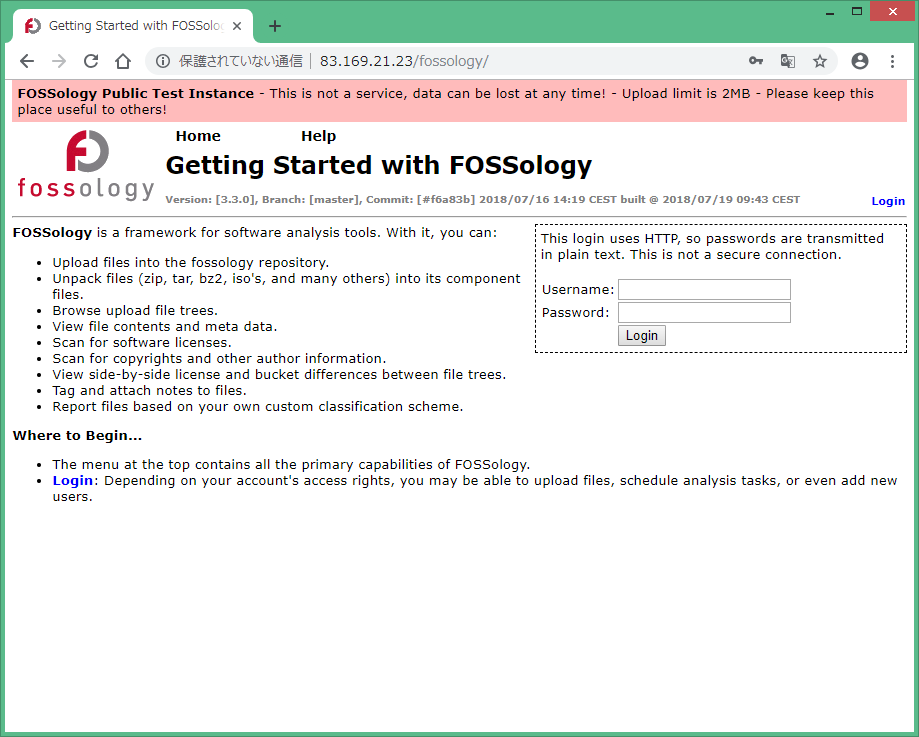
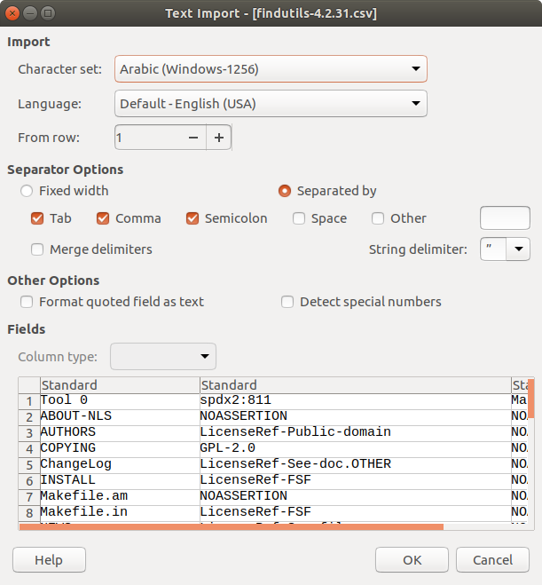

# OSS license analysis in an SPDX file generated by FOSSology

## reported by Yuki Machida (translated by Hiro Fukuchi)

original (Japanese): 
https://qiita.com/machida-yuki/items/8738961fa3133296d4c7

---

## About this report

Open Source Software (OSS) is one of the most important things in developing large systems. Therefore, to understand OSS and liceses is critical. 

OpenChain project hosted by the Linux Foundation is one of the OSS compliance activities to build trust over software supply chain. 

SPDX(Software Package Data Exchane) is an open standard for communicating software bill of material infomation (including components, licenses, copyrights, and security references). FOSSology is a tool for scanning software source code and generating SPDX.

This report gives an example procedure to analyze licenses in an SPDX file generated by FOSSology. 

---

## Operating environment

Note: Only the following environment has been used.

(This report is originally written for Japanese readers, so that we use Japanese environment.) 


| Component        | Version  |
|:------------|:-------------|
| license-coverage-grader | 41baaa4 |
| Python | 2.7.12 |
| FOSSology | 3.4.0  |
| SPDX | 2.1 |
| SPDX License List | 2.6 |
| Git | 2.17.1 |
| Google Chrome | 70.0.3538.77  |
| LibreOffice | 6.0.3.2 |
| Ubuntu Desktop Japanese Remix	 |  18.04 |

---

## Procedure

Prerequisite: 
Ubuntu Desktop Japanese Remix is installed.
Basic setting of enviroment is completed.


### Installing license-converage-grader

license-converage-grader is a tool to calcurate the "grade score" how accurate the SPDX file gives license information for included files. 

If you need more information, please refer to the folloeing URL.

* GitHub - license-coverage-grader
  * https://github.com/spdx/license-coverage-grader


Installing git and pip, using apt command.

```
$ sudo apt update
$ sudo apt install git python-pip
$ sudo -EH pip install --upgrade pip
```


Cloning license-coverage-grader.git from GitHub repository, installing python module.

```
$ git clone https://github.com/spdx/license-coverage-grader.git
$ cd license-coverage-grader/
$ sudo -EH pip install --editable .
```

### Analyzing source code, generating SDPX file

In this report, FOSSology demo server is used.

* FOSSology demo server
  * http://83.169.21.23/fossology

This report chooses "findutils" as input source code. 

* findutils
  * https://ftp.gnu.org/pub/gnu/findutils/findutils-4.2.31.tar.gz


Access the FOSSology demo server via web browser.

Username: testuser , Password: test




After successful login, the following screen image will appear.

Note: The uploaded file name in "test-incoming" may differ from this image.


Select source code file for uploading.

"Upload" -> "From URL"

The following screen image will apear.


Enter the URL at "Enter the URL to the file or directory: " 

Push the "upload" button at the bottom of the page.

Analysis will automatically start, after uploading the source code file. 


Generating SPDX file.

Select "Browse" tab. 

"Upload Name and Description"

From "-- select action --" section, select "Export SPDX tag value".


SPDX file will be generated, and file download will automatically start.


The downloaded file has the name "SPDX2TV_findutils-4.2.31.tar.gz_1541999637.spdx".
In this report, to simplify, the file name is changed to "findutils-4.2.31.spdx".


### Generating license list for each file

Convert SPDX file into CSV format using "license-coverage-grader". 

```
$ python -s <path to the directory of license-coverage-grader>/license-coverage-grader/spdx_scanner.py findutils-4.2.31.spdx > findutils-4.2.31.csv
```

Open "findutils-4.2.31.csv" using "LibreOffice". 
When "LibreOffice" asks the format, the default setting can be used. 
Push "OK" button. 





### Verifying licenses

To analyze CSV file, we use filter.

"Data" -> "Auto filter" 


In the first example, we verify the license in "COPYING" file in "findutils-4.2.31.csv". 
Push "▼" in the collumn A. Enter "COPYING" in the search window of the standard filter. 
"GPL-2.0" appears in the collumn B. We can verify the license as "GPL-2.0".


In the second example, we verify the license of "find.c" file. 
Push "▼" in the collumn A. Enter "find.c" in the search window of the standard filter. 
"GPL-2.0+" appears in the collumn B. We can verify the license as "GPL-2.0+".

The collumn B expresses section 4.6 "License Information in File" of the SPDX specification. 
This is the license information found in a file. 

* https://spdx.org/spdx-specification-21-web-version#h.111kx3o

"GPL-2.0" and "GPL-2.0+" are the "SPDX short identifiers", which is the expression defined in "SPDX License List" of SPDX specification. 

* https://spdx.org/licenses/GPL-2.0.html

* https://spdx.org/licenses/GPL-2.0+.html

If you want to know the SPDX specification, and the SPDX License List, please refer to the following URLs.

* https://spdx.org/sites/cpstandard/files/pages/files/spdxversion2.1.pdf

* https://spdx.org/licenses/

---

## Note

The author provides "ASIS" information and no warranty for trying the content of this report. 

This report uses FOSSology demo server, for beginners can try easily. 
Input files are transfered outside organization, so that files contain internal informaion or have large file size are not adequate for this test. In such cases, it is better to build an internal environment.

If you need more detail information about FOSSology environment, please visit FOSSology site.

* FOSSology environment
  * https://github.com/fossology/fossology/blob/master/README.md


---

## Resources

* OpenChain Project
  * https://www.openchainproject.org/
  
* SPDX
  * https://spdx.org/
  
* FOSSology
  * https://www.fossology.org/
  
* GitHub - license-coverage-grader
  * https://github.com/spdx/license-coverage-grader
  
* SPDX 2.1 Specification
  * https://spdx.org/sites/cpstandard/files/pages/files/spdxversion2.1.pdf
  
* SPDX License List
  * https://spdx.org/licenses/


